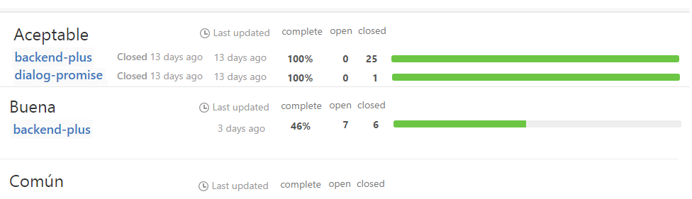

# milestone Aceptable

## objetivo del proyecto milestones

Tener un servicio web que unifique la visualización de milestones de varios orígenes

## objetivo del milestone Aceptable

Tener un servicio web que visualice unificadamente todos los milestones de todos los repositorios de una organización

### Ejemplo de pantalla



### Uso

Es una aplicacion de cliente web sin backend que recibe en la URL el nombre de la organización. Ej: 

```url
https://codenautas.com/milestones/#/codenautas
```

### Idea general

En github cada repositorio tiene sus propios milestones que tienen:
  1. Fecha esperada de finalización
  2. Estado: abierto o cerrado (el cierre es manual, no por vencimiento de fecha de finalización)
  3. Grupo de issues (cada issue puede estar asociado a un milestone)
  
**Si dos milestones se llaman igual** (en dos repositorios distintos) **es el mismo milestone**

El programa va a mostrar los milestones (ordenados por primera fecha esperada de finalización), 
dentro de cada milestone va a mostrar un renglón para cada repositorio que tenga un milestone con ese nombre.
La información a mostrar en cada milestione/repositorio es:

  1. Nombre del repositorio (linkeada al repositorio a la página de sus milestones)
  2. Estado del repositorio (Closed si está cerado, señal roja si está abierto y vencido, nada si está abierto y en fecha)
  3. Fecha esperada de terminación (si está abierto) o fecha de cerrado (si está cerrado)
  4. Período desde la última modificación (en días o meses y con un tooltip que contenga la fecha)
  5. Porcentaje de realización de issues (round(abiertos/totales*100))
  6. Issues abiertos
  7. Issues cerrados
  8. Gráfico de avance (igual al que aparece en las páginas de milestone)
  
## Dificultades

El api público de github tiene ciertas limitaciones que vamos a tener que encarar:
  1. 60 peticiones por hora (si no estás logueado, que es lo que vamos a tener en este milestone) https://developer.github.com/v3/#rate-limiting
  2. La paginación https://developer.github.com/v3/#pagination
  3. La falta de un query que devuelva qué repositorios tienen milestones y cuáles no.
  4. Cuando llegemos al límite de las peticiones por hora hay que avisar elegantemente al usuario. 
  
## Solución

  1. Para disminiur los problemas de las 60 peticiones por hora vamos a:
      1. Utilizar peticiones condicionales https://developer.github.com/v3/#conditional-requests para no volver a pedir lo que ya sabemos
      2. Almacenar en `localStorage` cada petición que se haga (con sus parámetros incluidos el `ETag` y `Last-Modified`) para recuperar la info localmente si github avisa que no se modificó
      3. Ordenar los repositorios por cantidad de issues abiertos, luego por si tiene issues o no
  2. Los pasos del algoritmo son:
      1. Obtener el nombre de la organización del hashtag de la dirección de la página (si no se especificó se supone "codenautas").
      2. Obtener todos los repositorios de la organización `https://api.github.com/orgs/codenautas/repos`
      3. Ordenar los repositorios
      4. Repositorio por repositorio traer sus milestones. 
          1. Si se acaba la cantidad de peticiones tomar los datos del `localStorage` y marcar como `mayBeOutdated: true` el repositorio
      5. Armar la lista unificada de milestones: 
          1. para considerarse que el milestone es el mismo alcanza con que tengan el mismo nombre
      6. Ordenar los milestones por su fecha de terminación (si hay más de un proyecto se toma el mínimo)
      7. Graficar milestones (del milestone solo se muestra el nombre)
          1. graficar los repositorios dentro de los milestones
          2. si el repositorio está marcado como `mayBeOutdated` toda la línea se pone en gris

## CSS

Usar el mismo sistema de estilos para las barras de avance

clases         |destino|uso 
---------------|-------|---------      
milestone-row  |tr     | renglón que contiene el nombre del milestone y los títulos de las columnas
repository-row |tr     | renglón que contiene el nombre del repositorio y sus datos
may-be-outdated|tr     | renglón correspondiente a un repositorio macado con `mayBeOutdated`
delayed        |tr     | renglón correspondiente a un repositorio que tiene ese milestone vencido (o sea que debió terminar y todavía no se cerró)
milestone-name |td     | nombre del milestone
repository-name|td     | nombre del repositorio
state          |td     | estado
closed-at      |td     | fecha de cierre
due-on         |td     | fecha en la que debería terminar
updated-at     |td     | última modificación
percent-complete|td    | porcentaje de completitud
open-issues    |td     | cantidad de issues abiertos
closed-issues  |td     | cantidad de issues cerrados
titles         |td     | títulos de los campos en la línea de milestones
